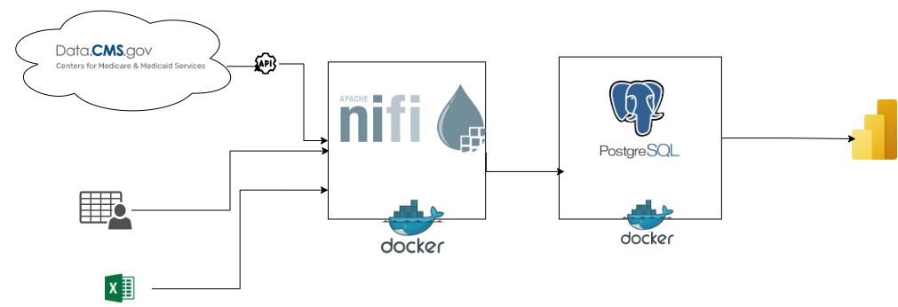
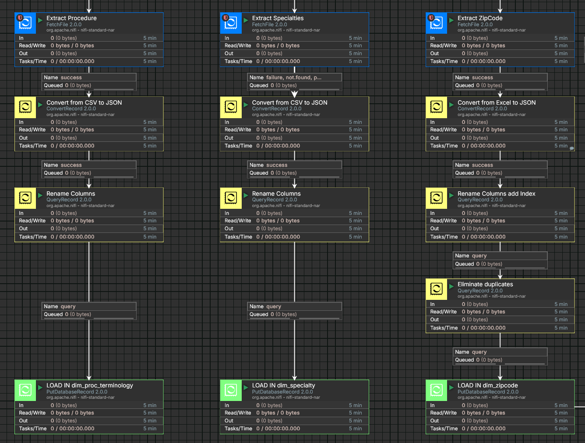
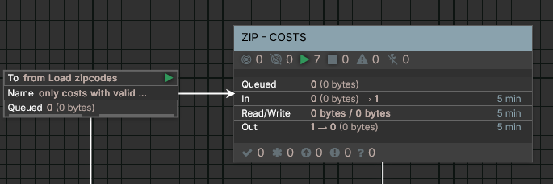
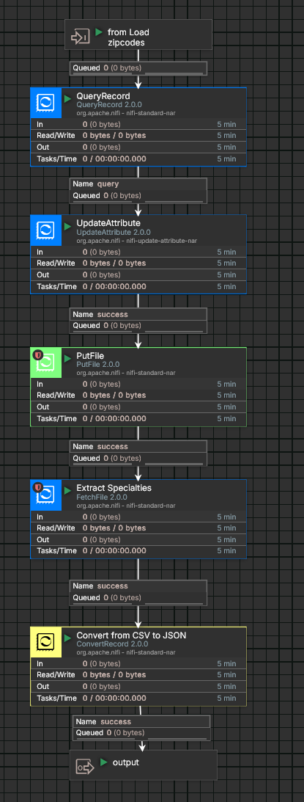

| APIs, CSV, EXCEL | NIFI | POSTGRESQL | DOCKER | POWERBI |
|---|---|---|---|---| 
| Data Source | ETL Pipeline | Data Storage | Containerization | Data Visualization |

## Introduction

In this project, we'll develop an ETL pipeline using Apache NiFi to process healthcare data from Medicare.gov's procedure price lookup. This rich dataset allows us to analyze pricing trends across various medical specialties and zip codes throughout the United States. By extracting the data, we can identify minimum, maximum, and most frequent (mode) prices charged by Medicare-certified suppliers, providing valuable insights into healthcare cost variations.

### Key Components:

*  Data Extraction: Using NiFi, we will extract data from Medicare.gov APIs specifically focusing on surgery specialties.
    * Cardiac Surgery
    * Colorectal Surgery
    * General Surgery
    * Hand Surgery
    * Maxillofacial Surgery
    * Micrographic Dermatologic Surgery
    * Neurosurgery
    * Oral Surgery
    * Orthopedic Surgery
    * Plastic and Reconstructive Surgery
    * Thoracic Surgery
    * Vascular Surgery

*  Data Transformation: Processing and preparing the data for analysis.
    *  Rename columns to align with data warehouse standards.
    *  Add classification attributes for enhanced analysis.
    
*  Data Loading: Loading the processed data into a data warehouse.
    * Dimension Tables:
      * **dim_zipcode**: Contains all US zipcodes with corresponding descriptions (city, state, etc.).
      * **dim_specialty**: Contains different medical specialties.
      * **dim_proc_terminology**: Contains alphanumeric codes used to describe medical, surgical, and diagnostic services
    * Fact Table:
      * **fact_visit_cost**: Contains all costs from different specialties.
*  Data Visualization: Leveraging Power BI to create interactive dashboards and visualizations for insightful analysis.


## Arquitecture



## Tools:
*  Programming Language - NiFi Expression Language
*  Scripting Language - SQL
*  Pipeline software - NIFI
*  Data warehouse - PostgreSQL database
*  Environments - Docker
*  Tests - Postman (Test APIs)
*  Visualisation - PowerBI


## Data Model


## Environments

*  NIFI and PosgreSQL [docker-compose.yml](docker-compose.yml) 

Both NIFI and the Data Warehouse in PostgreSQL will be deployed in the same Docker Compose file.  

```yml
version: '3'

services:
  nifi:
    cap_add:
      - NET_ADMIN # low port bindings
    image: apache/nifi:2.0.0
    environment:
      - TZ=America/Montreal
      - NIFI_WEB_HTTP_HOST=nifi
      - SINGLE_USER_CREDENTIALS_USERNAME=dataengineer
      - SINGLE_USER_CREDENTIALS_PASSWORD=dataengineer
      
    container_name: healthcare-nifi
    ports:
      - "8080:8080/tcp" # HTTP interface
      - "8443:8443/tcp" # HTTPS interface
      - "514:514/tcp" # Syslog
      - "514:514/udp" # Syslog
      - "2055:2055/udp" # NetFlow
    volumes:
      - ./drivers:/opt/nifi/nifi-current/drivers
      - ./certs:/opt/certs
      - ./datasets:/opt/nifi/nifi-current/datasets
      - ./flow_definition:/opt/nifi/nifi-current/flow_definition
      - nifi-conf:/opt/nifi/nifi-current/conf
      #- ./drivers/postgresql-42.7.4.jar:/opt/nifi/nifi-current/drivers/postgresql-42.7.4.jar
      
    restart: unless-stopped

  postgres:
    image: postgres:latest
    container_name: healthcare-dw
    restart: always # Restart the container if it stops
    ports:
      - 51432:5432
    volumes:
      - ./postgres-datawarehouse:/var/lib/postgresql/data
    environment:
      - POSTGRES_PASSWORD=postgres
      - POSTGRES_USER=postgres
      - POSTGRES_DB=healthcare 
    
volumes:
  drivers:
  certs:
  datasets:
  flow_definition:
  nifi-conf:
  postgres-datawarehouse:   
```

Launch the docker compose in same git repository directory:

```bash
docker compose up -d
```

Open NIFI in browser:
```http
https://localhost:8443/
```

As specified in the Docker Compose file, the username and password for both NIFI and Postgres will be identical:
```text
user:  dataengineer
password: dataengineer
```
```text
user:  postgres
password: postgres
database name: healthcare
```


## Scripts
For this NiFi project, I exclusively utilized the NiFi Definition Language and SQL  to configure all data flow components and their interactions.


## Visualisations
🚧 **Under Construction** 🚧


## NIFI Pipeline

*  Flow Definition in  [flow definition](/flow_definition/HEALTHCARE-PROVIDER-COSTS.json)

### Pipeline general view

*  Initialize Flow processor (**GenerateFlowFile**) wil launch the pipeline and sent differents attributes to corresponding branches of pipeline.


### Dimension Tables:

* Source Data: Dimension table source files are in CSV and Excel formats.
* Data Transformation:
  * Employs the ConvertRecord processor to convert data to JSON format before transformation.
  * Approach: Employs the QueryRecord processor for efficient and targeted data transformations.
* Load:
  * Approach:  Employs of PutDatabaseRecord processor to load in Postgres.  




### Factual Table:

*  **Dimension Table Loading**: After loading all dimension tables, proceed with the extraction and transformation of cost-related data.
*  **Data Filtering**: To ensure data accuracy, filter the cost data to include only records whose zip codes are present in the corresponding source data utilized for this project.
*  **Nifi Process Group**: For enhanced reliability and maintainability, all these transformations are encapsulated within a dedicated NiFi process group named "ZIP - COSTS."





*  **EXTRACT Process Group**: Cost data is retrieved through API requests within this process group.
*  **API Request Specificity**: The FlowFile attributes include a unique keyword for each API, which is used to dynamically construct the API request.
* **Data Retrieval**: The InvokeHTTP processor is utilized to fetch data from the respective APIs based on the specified keywords.
* **Batch Processing**: Due to the server-imposed 2000-record limit per request, a loop mechanism is implemented. This loop retrieves data in batches of 2000 records, incrementing the offset in each iteration until all records are successfully retrieved.


#### TRANSFORM Process Group:

*  This process group splits the incoming FlowFile into individual JSON records.
*  The specialty_id attribute is added to each individual record.
*  JSON attribute names are renamed to align with the corresponding column names in the data warehouse table.
*  To optimize data warehouse loading performance, the MergeContent processor is utilized to merge individual FlowFiles into smaller groups before the loading step.


## Dataset Used
*  See APIs - [datasets](https://data.cms.gov/provider-data/topics/physician-office-visit-costs)

## Data Sources
-  [Official website of the United States government](https://data.cms.gov/provider-data/topics/physician-office-visit-costs)
- [Stablished Patient Office Visit codes (99211-99215)](https://www.palmettogba.com/palmetto/jmb.nsf/DIDC/AA8LL61250~eServices%20Portal~Electronic%20Comparative%20Billing%20Report%20(eCBR))
- [USPS - POSTALPRO](https://postalpro.usps.com/ZIP_Locale_Detail)

