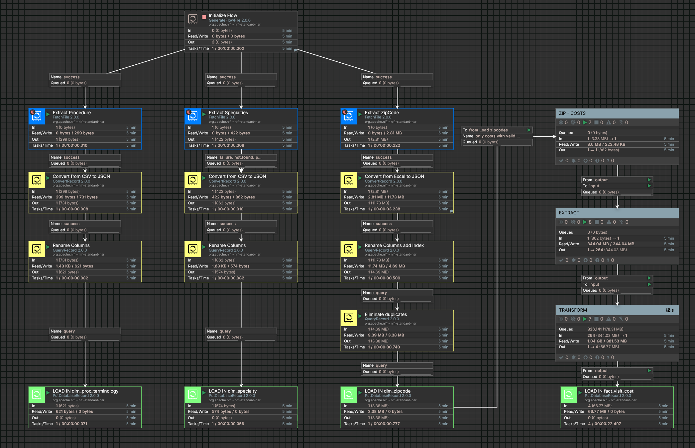

| APIs, CSV, EXCEL | NIFI | POSTGRESQL | DOCKER | POWERBI |
|---|---|---|---|---| 
| Data Source | ETL Pipeline | Data Storage | Containerization | Data Visualization |

## Introduction

In this project, we'll develop an ETL pipeline using Apache NiFi to process healthcare data from Medicare.gov's procedure price lookup. This rich dataset allows us to analyze pricing trends across various medical specialties and zip codes throughout the United States. By extracting the data, we can identify minimum, maximum, and most frequent (mode) prices charged by Medicare-certified suppliers, providing valuable insights into healthcare cost variations.

### Key Components:

*  Data Extraction: Using NiFi, we will extract data from Medicare.gov APIs specifically focusing on surgery specialties.
    * Cardiac Surgery
    * Colorectal Surgery
    * General Surgery
    * Hand Surgery
    * Maxillofacial Surgery
    * Micrographic Dermatologic Surgery
    * Neurosurgery
    * Oral Surgery
    * Orthopedic Surgery
    * Plastic and Reconstructive Surgery
    * Thoracic Surgery
    * Vascular Surgery

*  Data Transformation: Processing and preparing the data for analysis.
    *  Rename columns to align with data warehouse standards.
    *  Add classification attributes for enhanced analysis.
    
*  Data Loading: Loading the processed data into a data warehouse.
    * Dimension Tables:
      * **dim_zipcode**: Contains all US zipcodes with corresponding descriptions (city, state, etc.).
      * **dim_specialty**: Contains different medical specialties.
      * **dim_proc_terminology**: Contains alphanumeric codes used to describe medical, surgical, and diagnostic services
    * Fact Table:
      * **fact_visit_cost**: Contains all costs from different specialties.
*  Data Visualization: Leveraging Power BI to create interactive dashboards and visualizations for insightful analysis.


## Arquitecture


## Tools:
*  Programming Language - NiFi Expression Language
*  Scripting Language - SQL
*  Pipeline software - NIFI
*  Data warehouse - PostgreSQL database
*  Environments - Docker
*  Tests - Postman (Test APIs)
*  Visualisation - PowerBI


## Data Model


## Environments

*  NIFI and PosgreSQL [docker-compose.yml](docker-compose.yml) 

Both NIFI and the Data Warehouse in PostgreSQL will be deployed in the same Docker Compose file.  

```yml
version: '3'

services:
  nifi:
    cap_add:
      - NET_ADMIN # low port bindings
    image: apache/nifi:2.0.0
    environment:
      - TZ=America/Montreal
      - NIFI_WEB_HTTP_HOST=nifi
      - SINGLE_USER_CREDENTIALS_USERNAME=dataengineer
      - SINGLE_USER_CREDENTIALS_PASSWORD=dataengineer
      
    container_name: healthcare-nifi
    ports:
      - "8080:8080/tcp" # HTTP interface
      - "8443:8443/tcp" # HTTPS interface
      - "514:514/tcp" # Syslog
      - "514:514/udp" # Syslog
      - "2055:2055/udp" # NetFlow
    volumes:
      - ./drivers:/opt/nifi/nifi-current/drivers
      - ./certs:/opt/certs
      - ./datasets:/opt/nifi/nifi-current/datasets
      - ./flow_definition:/opt/nifi/nifi-current/flow_definition
      - nifi-conf:/opt/nifi/nifi-current/conf
      #- ./drivers/postgresql-42.7.4.jar:/opt/nifi/nifi-current/drivers/postgresql-42.7.4.jar
      
    restart: unless-stopped

  postgres:
    image: postgres:latest
    container_name: healthcare-dw
    restart: always # Restart the container if it stops
    ports:
      - 51432:5432
    volumes:
      - ./postgres-datawarehouse:/var/lib/postgresql/data
    environment:
      - POSTGRES_PASSWORD=postgres
      - POSTGRES_USER=postgres
      - POSTGRES_DB=healthcare 
    
volumes:
  drivers:
  certs:
  datasets:
  flow_definition:
  nifi-conf:
  postgres-datawarehouse:   
```

Launch the docker compose in same git repository directory:

```bash
docker compose up -d
```

Open NIFI in browser:
```http
https://localhost:8443/
```

As specified in the Docker Compose file, the username and password for both NIFI and Postgres will be identical:
```text
user:  dataengineer
password: dataengineer
```
```text
user:  postgres
password: postgres
database name: healthcare
```


## Scripts
🚧 **Under Construction** 🚧


## Visualisations
🚧 **Under Construction** 🚧


## NIFI Pipeline

*  Flow Definition in  [flow definition](/flow_definition/HEALTHCARE-PROVIDER-COSTS.json)

### Pipeline general view

*  Initialize Flow processor (**GenerateFlowFile**) wil launch the pipeline and sent differents attributes to next processors. 
*  Load Specialties File (**FetchFile**) will load a csv files with the all surgery specialties and respective API code to be userd to retrives the corresponding data.  



### SPECIALTY COST process group

*  The SPECIALTY COST process group will extract and transform data retrieved from API requests.


### EXTRACT process group

* This is the mos important process.  For each specialty retrieves all the costs and corresponding zipcodes.
* Since retrieving all records in a single request is impossible due to the server's 2000-record limit, a loop is implemented. This loop fetches data in batches of 2000, incrementing the offset for each iteration until all records are retrieved.


### TRANSFORM process group
*  This process group splits the FlowFile into individual records.
*  The id_specialty is added to each JSON record.
*  JSON attributes are renamed to match the corresponding column names in the data warehouse table.


### LOAD in fact_visit_cost
*  Transform json file to record.
*  Insert record in fact_visit_cost tables in PosgresSQL database. 


🚧 **Under Construction** 🚧


## Dataset Used
*  See APIs - [datasets](https://data.cms.gov/provider-data/topics/physician-office-visit-costs)

## Data Sources
-  [Official website of the United States government](https://data.cms.gov/provider-data/topics/physician-office-visit-costs)
- [Stablished Patient Office Visit codes (99211-99215)](https://www.palmettogba.com/palmetto/jmb.nsf/DIDC/AA8LL61250~eServices%20Portal~Electronic%20Comparative%20Billing%20Report%20(eCBR))
- [USPS - POSTALPRO](https://postalpro.usps.com/ZIP_Locale_Detail)

